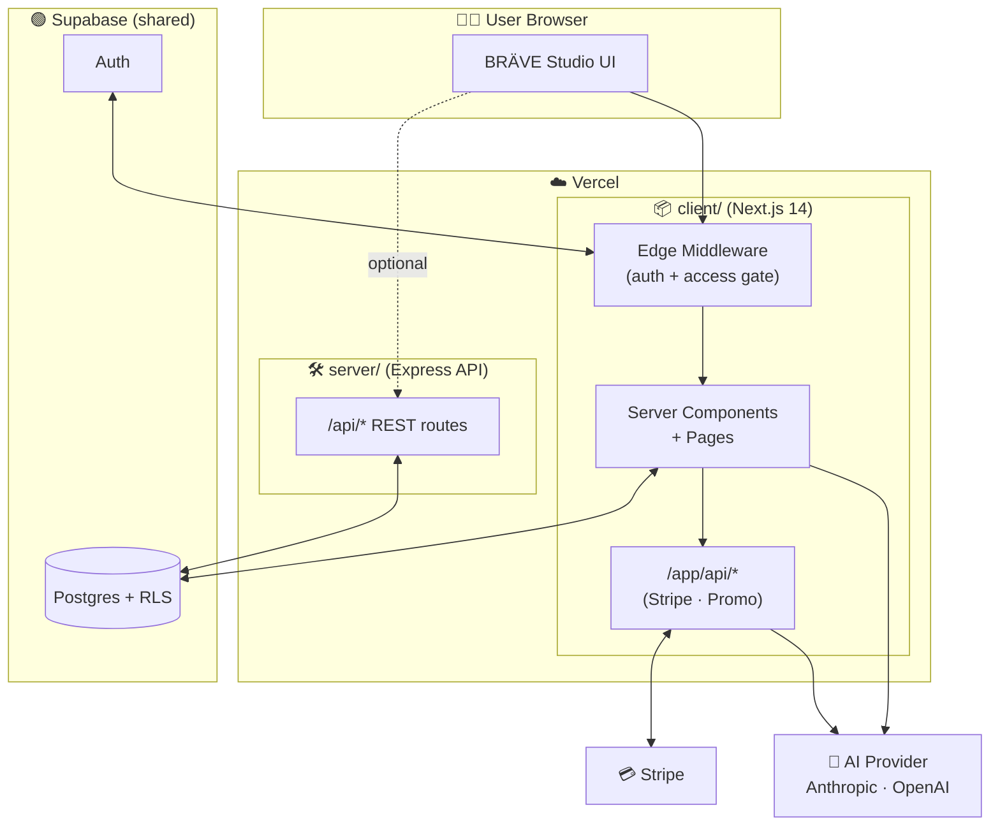
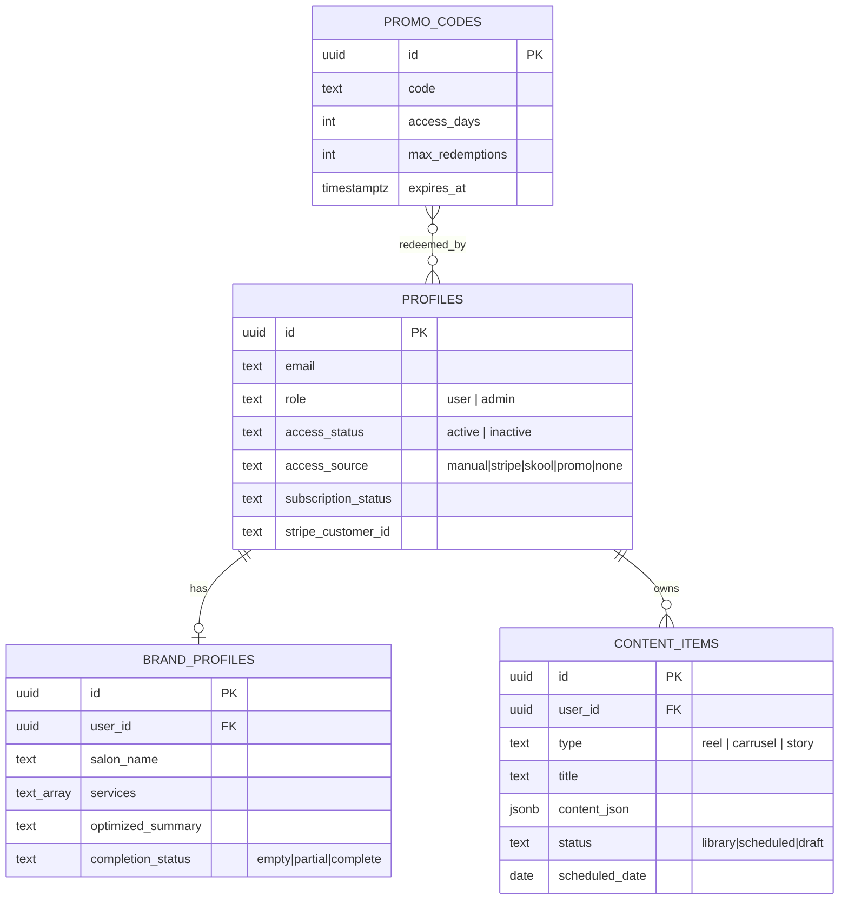

<div align="center">

# ✨ BRÄVE Studio ✨

### AI-powered social media content studio for beauty & hair salon professionals

_Turn your brand into a content machine — generate **Reels**, **Carousels** & **Stories**, plan them on a calendar, and grow your salon's Instagram on autopilot._

<br/>


<br/>


</div>

---

## 📑 Table of Contents

- [🌟 Overview](#-overview)
- [✨ Features](#-features)
- [🧱 Tech Stack](#-tech-stack)
- [🏛️ Architecture](#️-architecture)
- [📂 Project Structure](#-project-structure)
- [🚀 Quick Start](#-quick-start)
- [🔐 Environment Variables](#-environment-variables)
- [🗄️ Database Schema](#️-database-schema)
- [🔌 Backend API Reference](#-backend-api-reference)
- [🧭 Application Routes](#-application-routes)
- [☁️ Deployment (Vercel)](#️-deployment-vercel)
- [📜 Scripts](#-scripts)
- [🛡️ Security Notes](#️-security-notes)
- [🗺️ Roadmap](#️-roadmap)
- [🤝 Contributing](#-contributing)
- [📄 License](#-license)

---

## 🌟 Overview

**BRÄVE Studio** is a SaaS platform that helps salon owners and beauty professionals
produce a consistent, on-brand Instagram presence — without spending hours staring at
a blank screen.

The user fills in a **Brand Profile** once (their services, ideal client, goals, voice),
and BRÄVE turns that context into ready-to-publish content ideas: short-form **Reels**,
swipeable **Carousels**, and ephemeral **Stories** — complete with captions, hashtags,
and visual direction. Everything can be saved to a **content library** and dropped onto
a **planning calendar**.

Access is gated behind a **subscription & access-control layer** (Stripe subscriptions,
promo codes, Skool community, or manual admin activation), with a dedicated **admin panel**
to manage members.

> 💡 **The codebase is a monorepo** of two independently deployable apps: a Next.js
> **client** (the product) and an Express **server** (a clean backend foundation that
> grows alongside it).

---

## ✨ Features

| | Feature | Description |
|---|---------|-------------|
| 🎬 | **AI Reels** | Generate hook-driven short-form video scripts tailored to a service & objective. |
| 🖼️ | **AI Carousels** | Multi-slide swipe posts with titles, body copy and a closing CTA. |
| 📲 | **AI Stories** | Quick, engaging story sequences for daily posting. |
| 🧠 | **Brand Profiling** | A guided intake that captures salon identity, voice, ideal client & goals, then produces an *optimized brand summary* used to ground every generation. |
| 🗓️ | **Content Planner** | Schedule content on a calendar; move items between `library → scheduled → draft`. |
| 📚 | **Content Library** | Persist every generated item with caption, hashtags & visual idea. |
| 🐾 | **Bravi Mascot** | A friendly brand mascot that guides the experience. |
| 🔑 | **Multi-source Access** | Unlock via **Stripe** subscription, **promo code**, **Skool**, or **manual** admin grant. |
| 💳 | **Stripe Billing** | Checkout sessions, customer portal & webhooks for subscription lifecycle. |
| 🎟️ | **Promo Codes** | Redeemable codes with expiry, max-redemptions & access-day grants. |
| 🛡️ | **Admin Panel** | Activate/deactivate members, view profiles, manage promo codes. |
| 🔒 | **Row-Level Security** | Supabase RLS guarantees users only ever touch their own data. |
| 🌐 | **i18n-ready (ES)** | Spanish-first UI for the target market. |
| 🔌 | **Pluggable AI** | Swap providers via env: `anthropic` · `openai` · `mock` (zero-cost local dev). |

---

## 🧱 Tech Stack

<table>
<tr>
<td valign="top" width="50%">

### 🎨 Client (Frontend)
- **Next.js 14** — App Router, Server Components
- **React 18** + **TypeScript 5**
- **Tailwind CSS v4** + PostCSS
- **lucide-react** — icons
- **@supabase/ssr** — cookie-based auth
- **Stripe.js** — checkout & billing
- Edge **middleware** for route protection

</td>
<td valign="top" width="50%">

### ⚙️ Server (Backend)
- **Express 4** + **TypeScript 5**
- Modular **MVC** (config · lib · middleware · controllers · routes)
- **@supabase/supabase-js** — admin & per-user clients
- **cors** + centralized error handling
- **dotenv** — validated env config
- **tsx** — instant TS dev runtime
- **Vercel** serverless adapter

</td>
</tr>
</table>

**Shared platform:** [Supabase](https://supabase.com) (Postgres + Auth + RLS) · [Stripe](https://stripe.com) (Payments) · [Vercel](https://vercel.com) (Hosting)

---

## 🏛️ Architecture

A **monorepo** with two apps that deploy independently but share one Supabase project.



> **Why two apps?** Next.js is fullstack, so the **client** already ships its own API
> routes (Stripe, promo). The **server** is a clean, framework-light home for new backend
> services (webhooks, cron jobs, heavy integrations) that you don't want coupled to the UI
> deployment. Each can scale, deploy, and fail independently.

---

## 📂 Project Structure

```text
brave-studio/
├── 📦 client/                      # Next.js 14 app — the product (frontend)
│   ├── app/
│   │   ├── (app)/                  # Authenticated product area
│   │   │   ├── inicio/             #   • Dashboard / home
│   │   │   ├── crear-contenido/    #   • AI content generator
│   │   │   ├── mi-marca/           #   • Brand profile editor
│   │   │   ├── planificar/         #   • Content calendar / planner
│   │   │   └── stories/            #   • Stories generator
│   │   ├── (auth)/                 # Login, access & blocked screens
│   │   ├── admin/                  # Admin panel
│   │   ├── api/                    # Next.js API routes
│   │   │   ├── stripe/             #   • checkout · portal · webhook
│   │   │   └── promo/redeem/       #   • promo code redemption
│   │   ├── layout.tsx              # Root layout
│   │   └── globals.css             # Tailwind styles
│   ├── components/
│   │   ├── bravi/BraviMascot.tsx   # Brand mascot
│   │   └── layout/Sidebar.tsx      # App navigation
│   ├── lib/
│   │   ├── ai/                     # AI provider + prompt templates
│   │   │   └── prompts/            #   • reels · carousels · stories · planner
│   │   ├── supabase/               # client · server · admin clients
│   │   ├── access.ts               # access-control logic
│   │   └── stripe.ts               # Stripe SDK init
│   ├── types/                      # Shared DB & global types
│   ├── middleware.ts               # Route protection + access gating
│   └── package.json
│
├── 🛠️ server/                      # Express + TypeScript REST API (backend)
│   ├── api/index.ts                # Vercel serverless entry
│   ├── src/
│   │   ├── config/env.ts           # Validated environment config
│   │   ├── lib/supabase.ts         # Admin + per-user Supabase clients
│   │   ├── middleware/
│   │   │   ├── auth.ts             # Verifies Supabase bearer token
│   │   │   └── errorHandler.ts     # 404 + centralized error handling
│   │   ├── controllers/            # Request handlers (business logic)
│   │   ├── routes/                 # Route modules mounted under /api
│   │   ├── app.ts                  # Builds the Express app (no listen)
│   │   └── index.ts                # Local dev entry (app.listen)
│   ├── supabase-schema.sql         # 🗄️ Database schema (source of truth)
│   ├── vercel.json                 # Serverless routing
│   └── package.json
│
├── README.md                       # 📖 You are here
└── .gitignore
```

---

## 🚀 Quick Start

### ✅ Prerequisites

- **Node.js** ≥ 18
- **npm** ≥ 9
- A **Supabase** project ([create one free](https://supabase.com))
- _(optional)_ **Stripe** account for billing
- _(optional)_ **Anthropic** or **OpenAI** API key for live AI generation

### 1️⃣ Clone

```bash
git clone https://github.com/JotaMoyaMartin/BRAVESTUDIO-JULIO.git
cd BRAVESTUDIO-JULIO
```

### 2️⃣ Set up the database

Open your Supabase project → **SQL Editor** → paste and run
[`server/supabase-schema.sql`](server/supabase-schema.sql). This creates all tables,
RLS policies, triggers and indexes.

### 3️⃣ Run the **Client** (frontend)

```bash
cd client
cp .env.example .env.local      # then fill in your Supabase keys
npm install
npm run dev                     # ▶ http://localhost:3000
```

### 4️⃣ Run the **Server** (backend)

```bash
cd server
cp .env.example .env            # then fill in your Supabase keys
npm install
npm run dev                     # ▶ http://localhost:4000
```

Verify the backend is healthy:

```bash
curl http://localhost:4000/api/health        # → { "status": "ok", ... }
curl http://localhost:4000/api/health/ready  # → { "status": "ok", "database": "reachable" }
```

---

## 🔐 Environment Variables

Each app keeps its own env file, both **gitignored** — secrets never enter version control.

### 📦 `client/.env.local`

| Variable | Required | Scope | Description |
|----------|:--------:|-------|-------------|
| `NEXT_PUBLIC_SUPABASE_URL` | ✅ | browser + server | Supabase project URL |
| `NEXT_PUBLIC_SUPABASE_ANON_KEY` | ✅ | browser + server | Publishable (anon) key — safe to expose |
| `SUPABASE_SERVICE_ROLE_KEY` | ✅ | **server only** | Secret key — bypasses RLS, never expose |
| `AI_PROVIDER` | ⬜ | server | `anthropic` · `openai` · `mock` (default `mock`) |
| `AI_API_KEY` | ⬜ | server | API key for the chosen AI provider |
| `STRIPE_SECRET_KEY` | ⬜ | server | Enables Stripe billing |
| `NEXT_PUBLIC_API_URL` | ⬜ | browser | Base URL of the `server/` API |

### 🛠️ `server/.env`

| Variable | Required | Description |
|----------|:--------:|-------------|
| `PORT` | ⬜ | API port (default `4000`) |
| `NODE_ENV` | ⬜ | `development` · `production` |
| `CORS_ORIGIN` | ⬜ | Comma-separated allowed origins (the client URL) |
| `SUPABASE_URL` | ✅ | Supabase project URL |
| `SUPABASE_ANON_KEY` | ✅ | Publishable (anon) key |
| `SUPABASE_SERVICE_ROLE_KEY` | ✅ | Secret key — bypasses RLS, **server only** |

> 🔁 Both apps point at the **same Supabase project**, so auth & data stay in sync.

---

## 🗄️ Database Schema

Four tables under Postgres, all protected by **Row-Level Security**.



**Highlights**
- 🔐 **RLS everywhere** — users can only read/write their own `profiles`, `brand_profiles` & `content_items`; admins get elevated read/update.
- 🪝 **Auto-provisioning** — a trigger creates a `profiles` row on every new `auth.users` signup (inactive by default → admin/billing must activate).
- ⏱️ **`updated_at` triggers** keep timestamps fresh automatically.
- 🚀 **Indexes** on `stripe_customer_id` and promo `code` for fast lookups.

---

## 🔌 Backend API Reference

Base URL: `http://localhost:4000` (local) · your Vercel server URL (prod)

| Method | Endpoint | Auth | Description |
|:------:|----------|:----:|-------------|
| `GET` | `/` | — | Service banner / running status |
| `GET` | `/api/health` | — | **Liveness** — process is up |
| `GET` | `/api/health/ready` | — | **Readiness** — verifies Supabase connectivity |

> 🔒 Protected routes use the `requireAuth` middleware, which expects a
> `Authorization: Bearer <supabase-access-token>` header and attaches the resolved user
> to the request.

**Add a new feature module** in three steps:

```text
1. src/controllers/<name>.controller.ts   →  write the handler
2. src/routes/<name>.route.ts             →  define the routes
3. src/routes/index.ts                    →  router.use('/<name>', <name>Route)
```

---

## 🧭 Application Routes

| Path | Area | Access | Purpose |
|------|------|:------:|---------|
| `/login` | Auth | 🌐 public | Sign in |
| `/access` | Auth | 🌐 public | Choose how to unlock access |
| `/acceso-bloqueado` | Auth | 🌐 public | Shown when access is inactive |
| `/inicio` | App | 🔒 member | Dashboard / home |
| `/crear-contenido` | App | 🔒 member | AI content generator |
| `/mi-marca` | App | 🔒 member | Brand profile editor |
| `/planificar` | App | 🔒 member | Content calendar |
| `/stories` | App | 🔒 member | Stories generator |
| `/admin` | Admin | 👑 admin | Member & promo management |

Protection is enforced in [`client/middleware.ts`](client/middleware.ts): unauthenticated
users are redirected to `/login`, inactive members to `/access`, and non-admins are kept
out of `/admin`.

---

## ☁️ Deployment (Vercel)

Deploy **two separate Vercel projects from this one repo** — the magic is the
**Root Directory** setting.

| Vercel Project | Root Directory | Framework Preset | Env vars |
|----------------|:--------------:|:----------------:|----------|
| 🎨 **Frontend** | `client` | **Next.js** | `NEXT_PUBLIC_SUPABASE_URL`, `NEXT_PUBLIC_SUPABASE_ANON_KEY`, `SUPABASE_SERVICE_ROLE_KEY` _(+ Stripe / AI)_ |
| ⚙️ **Backend** | `server` | **Other** | `SUPABASE_URL`, `SUPABASE_ANON_KEY`, `SUPABASE_SERVICE_ROLE_KEY`, `CORS_ORIGIN` |

**Steps (per project):**

```text
Vercel Dashboard → Add New… → Project
   → Import this Git repository
   → Settings → General → Root Directory →  client   (or  server )
   → Settings → Environment Variables → add the keys above
   → Deploy 🚀
```

> The `server/` app ships a [`vercel.json`](server/vercel.json) that rewrites every request
> to the Express app via the serverless entry at `server/api/index.ts` — no extra config
> needed.

---

## 📜 Scripts

### 📦 Client

| Command | Description |
|---------|-------------|
| `npm run dev` | Start Next.js dev server (`:3000`) |
| `npm run build` | Production build |
| `npm run start` | Serve the production build |
| `npm run lint` | Lint with Next.js ESLint |

### 🛠️ Server

| Command | Description |
|---------|-------------|
| `npm run dev` | Start API with hot-reload via `tsx` (`:4000`) |
| `npm run build` | Compile TypeScript → `dist/` |
| `npm run start` | Run the compiled server |
| `npm run typecheck` | Type-check without emitting |

---

## 🛡️ Security Notes

- 🚫 **Never commit secrets** — `.env` & `.env.local` are gitignored. Only `*.env.example` templates are tracked.
- 🔑 The **service-role key** bypasses RLS — keep it strictly server-side (used only in `lib/supabase/admin.ts` and `server/src/lib/supabase.ts`).
- 🧱 **RLS is your safety net** — every table enforces per-user access at the database layer.
- ✅ **Validate Stripe webhooks** with the signing secret before trusting their payload.
- 🌐 Lock down **`CORS_ORIGIN`** in production to your real client domain(s).

---

## 🗺️ Roadmap

- [ ] Migrate Stripe webhooks from `client/app/api` into the standalone `server/`
- [ ] Background jobs / cron for scheduled publishing
- [ ] Direct Instagram Graph API publishing
- [ ] Multi-language UI beyond Spanish
- [ ] Analytics dashboard (engagement, best-performing formats)
- [ ] Team / multi-seat salon accounts

---

## 🤝 Contributing

1. Create a feature branch: `git checkout -b feat/my-feature`
2. Keep changes scoped to `client/` **or** `server/` where possible
3. Run `npm run typecheck` / `npm run lint` before pushing
4. Open a PR with a clear description 🎉

---

## 📄 License

**Proprietary** — © BRÄVE Studio. All rights reserved.
Unauthorized copying, distribution or use is prohibited.

<div align="center">

<br/>

**Made with 💜 for salon professionals**

_Built with Next.js · Supabase · Stripe · Express_

</div>
